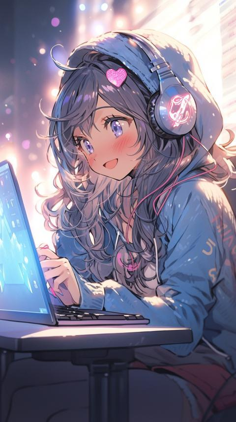

<h1>
  Hi There, I'm Rahma Hassan 👑
  
</h1>

I'm an AI & Machine Learning student with a strong interest in Computer Vision and Deep Learning.
I enjoy working with data, images, and building intelligent systems that can see and understand the world.

- 🤖 I’m currently studying **Artificial Intelligence, Machine Learning & Computer Vision**
- 🧠 I’m learning **Deep Learning, CNNs, OCR, and Image Processing**
- 🐍 I work mainly with **Python & Jupyter Notebook**
- 🔬 Tools & frameworks I use: **TensorFlow, OpenCV, NumPy**
- 🎯 Future Goals:  
  - Become a professional **AI / Computer Vision Engineer**  
  - Build real-world AI projects and research-based systems  

---

### 📫 Social Links

---

### 🛠 &nbsp;Technologies & Tools

---

### 📊 Most Used Languages

 

## 📌 Featured Projects

### 🪪 OCR System for Identity Cards
**Computer Vision | Image Processing | OCR**

- Built an OCR pipeline for extracting text from scanned and rotated ID cards.
- Applied advanced preprocessing techniques such as:
  - Image deskewing
  - Noise removal
  - Otsu thresholding
- Improved text recognition accuracy using Tesseract OCR.
- Tools: **Python, OpenCV, pytesseract, NumPy**

---

### 🎥 Sharp Frame Extraction from Video
**Computer Vision | Video Processing**

- Developed a system to extract the sharpest frames from a video using the Variance of Laplacian method.
- Ensured temporal diversity between selected frames.
- Optimized memory usage by reloading frames instead of storing them all in RAM.
- Tools: **Python, OpenCV**

---

### 🧠 Machine Learning Projects
**Machine Learning | Data Analysis**

- Implemented ML models for data classification and prediction.
- Applied preprocessing, feature scaling, and model evaluation techniques.
- Worked with real datasets to understand model behavior and performance.
- Tools: **Python, NumPy, Pandas, Scikit-learn**

---

### 🔍 Computer Vision Fundamentals
**Image Processing | Feature Extraction**

- Practiced edge detection, thresholding, filtering, and morphological operations.
- Built mini-projects using OpenCV to understand classical CV pipelines.
- Compared traditional CV approaches with Deep Learning-based methods.
